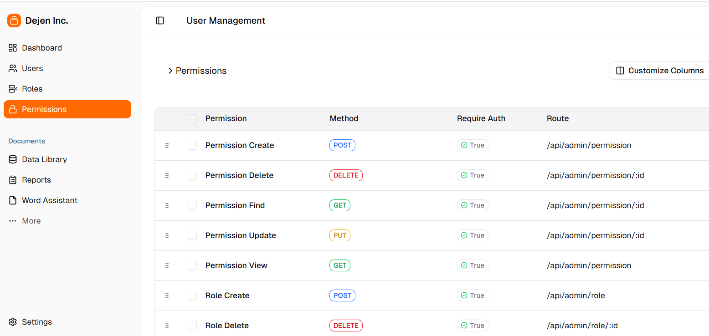

# Dejen RBDC (Role-Based Access Control MERN Stack)

A dynamic **Role-Based Access Control (RBAC)** system built with **Next.js** (React) on the frontend and **Express.js** on the backend. This project manages users, roles, and permissions with secure authentication, CRUD operations, and middleware protection.

---

## Features

- **Authentication & Authorization**
  - JWT token-based authentication with React Context and cookies for token persistence.
  - Middleware for protected routes to prevent unauthorized access.
- **Role & Permission Management**
  - CRUD for roles and permissions.
  - Permissions specify HTTP method, route, and auth requirement.
  - Color-coded HTTP methods for clarity.
- **UI Components**
  - Dialogs for creating and updating permissions and roles using ShadCN UI.
  - Confirmation dialogs for deletions.
  - Responsive UI with styled inputs, selects, and checkboxes.
- **State Management**
  - React Context (`AuthContext`) to manage login state and user data.
  - Cookies to persist auth tokens.
- **Backend**
  - Express.js API with endpoints for users, roles, permissions, and authentication.
  - Secure password hashing and JWT token issuance.
  - Error handling with clear messages.

---

## Tech Stack

- Frontend:
  - Next.js (App Router)
  - React Hook Form + Zod for form validation
  - ShadCN UI components (Dialog, Button, Input, Select, Checkbox)
  - Sonner for toast notifications
  - React Context for auth state
  - Cookies (js-cookie) for token persistence

- Backend:
  - Express.js with MongoDB/Mongoose
  - JWT for authentication
  - Bcrypt for password hashing

## ExpressJS-Dynamic-RBAC-role-based-access
Implement dynamic Role-based Access Control (RBAC) in Express JS REST API.

#I want to share how to implement dynamic role based access control (RBAC) system in express js (node js) API with Mongodb, with ES6+.

#There are many resources out there on creating a user account with role field in the user table. The limitation with this is that a user can only have one role at a time.

#Some software products such as management systems might require a user to share multiple roles and sometimes have direct permissions to perform an action.

#Testing with Postman  
#Register a user:  

 ```js
POST /api/auth/register  
Body: { "username": "admin","email":"abrahamjo25@gmail.com", "password": "admin@123" }  
```

#Login:  
```js
POST /api/auth/login  
Body: { "email": "abrahamjo25@gmail.com", "password": "admin@123" }
``` 
#Save the returned token for authorization.  

#Create a Permission:  

```js
eg 1
POST /api/admin/permission  
Headers: Authorization: Bearer <token>  
Body: { "name": "Create Role", "route": "/api/admin/role", "method": "POST" }
eg 2
POST /api/admin/permission  
Headers: Authorization: Bearer <token>  
Body: { "name": "View Profile", "route": "/api/user/profile", "method": "GET" }
```
#Create a Role:  
 ```js
POST /api/admin/role  
Headers: Authorization: Bearer <token>  
Body: { "name": "Admin", "permissions": ["<permission_id>"] }  
```
#Assign Role to User:  
```js
POST /api/admin/assign-role/userId  
Headers: Authorization: Bearer <token>  
Body: { "roles": ["<role_id>"] }
```


---
## .env
MONGODB_URI=your_mongodb_connection_string
JWT_SECRET=your_jwt_secret_key
PORT=5000


## Setup & Installation

### Backend

1. Clone the repository and navigate to the backend folder:

   ```bash
   cd backend
   npm install
   ```

   ```bash
   cd fronend
   npm install
   ```

   ```bash
  cd.. 
  npm install
  npm run dev
   ```
